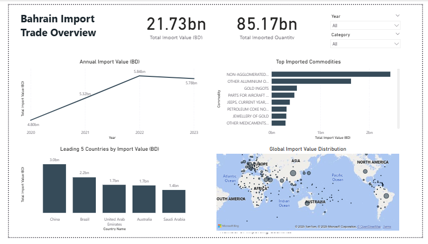

# Bahrain-Imports-Trade
## Overview
This repository contains an interactive Power BI dashboard analyzing Bahrain’s import trade trends from 2020 to 2023.
The dashboard highlights overall import performance, key commodities, major trade partners, and the global distribution of Bahrain’s imports.

## Data Source

- Bahrain Open Source Data Portal: Import datasets covering the years 2020, 2021, 2022, and 2023

## Tools & Technologies

- Power BI – Data visualization and dashboard design
- GitHub – Project sharing and documentation

## Dashboard Preview

